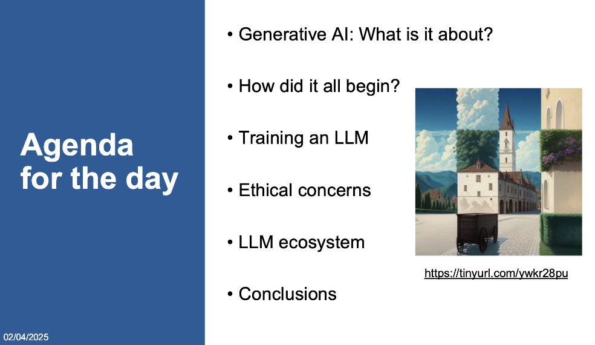
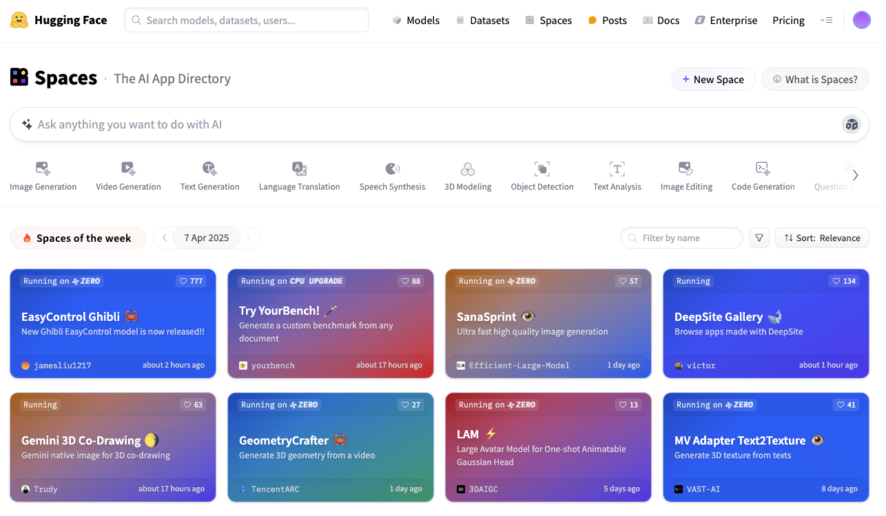

# SustAIn.Brussels training: ChatGPT and next-generation AI assistants

This repository contains the training material for the [SustAIN.Brussels training track on ChatGPT and next-generation assistants](https://www.sustain.brussels/fr_BE/event/chatgpt-next-generation-assistants-training-track-108/register). The track took place between the 2nd of April 2025 and the 4th of April 2025, at [FARI](https://www.fari.brussels/).

- Day 1, full day (6 hours) - [Yann-Aël Le Borgne](https://www.linkedin.com/in/yannaelb/) : Non-technical introduction to generative AI. The session was divided in five parts:

	- 1h30: Examples of generative AI applications
	- 1h30: Machine learning, image recognition and next-word prediction
	- 1h: LLM training, technical limits and mitigations
	- 1h: Ethical concerns: Biases, privacy and environmental impacts
	- 1h: LLM ecosystem: Proprietary and open-source solutions

- Day 2, half day (3 hours) - [Olivier Caelen](https://www.linkedin.com/in/oliviercaelen/) : Hands-on workshop on using the OpenAI API. Examples are mostly taken from Olivier's book "[Developing Apps with GPT-4 and ChatGPT](https://www.oreilly.com/library/view/developing-apps-with/9781098152475/)". The session covered:
	-  "Hello world": Connect to the OpenAI API and get responses from an OpenAI model
	-  Forcing GPT to return a JSON output
	-  How to analyse images with the vision API
	-  How to generate image with DALL-E 3
	-  Converting text to speech and speech to text

- Day 3, half day (3 hours) - [Yann-Aël Le Borgne](https://www.linkedin.com/in/yannaelb/): Hands-on workshop on using open-source generative AI models with Hugging Face, and deploying Gradio web applications. Examples are mostly taken from [Hugging Face online course on large language models](https://huggingface.co/learn/llm-course/chapter1/1?fw=pt). The session covered:

	- Text generation with open-source models (such as GPT2) using the Hugging Face transformers library
	- Building a web app with Gradio
	- Making a Gradio web app predict text with the transformers library, or OpenAI API
	- Deploying the web app on Hugging Face spaces for free