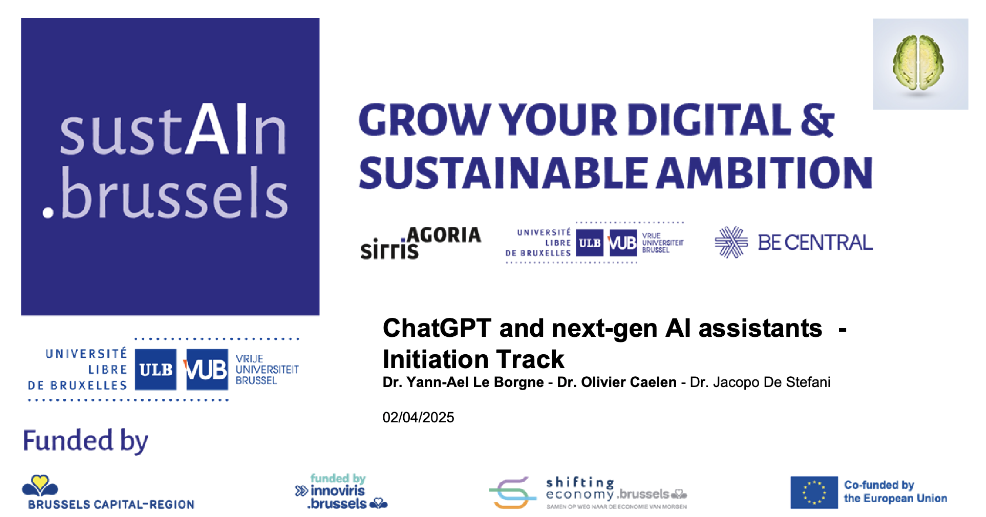
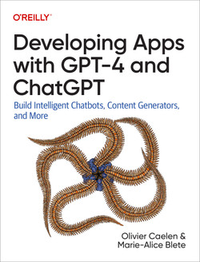

# SustAIn.Brussels training: ChatGPT and next-generation AI assistants

This repository contains the training material for the [SustAIN.Brussels training track on ChatGPT and next-generation assistants](https://www.sustain.brussels/fr_BE/event/chatgpt-next-generation-assistants-training-track-108/register). The track took place between the 2nd of April 2025 and the 4th of April 2025, at [FARI](https://www.fari.brussels/).

# Part 1: Non-technical introduction to generative AI

Full day (6 hours). Instructor: [Yann-Aël Le Borgne](https://www.linkedin.com/in/yannaelb/). The slides are [available here](https://github.com/Yannael/gen-ai-sustain-brussels/tree/main/Part_1_Intro_ChatGPT_AI_Assistants).

The day was divided in five main parts:

- 1h30: Examples of generative AI applications
- 1h30: Machine learning, image recognition and next-word prediction
- 1h: LLM training, technical limits and mitigations
- 1h: Ethical concerns: Biases, privacy and environmental impacts
- 1h: LLM ecosystem: Proprietary and open-source solutions

# Part 2: Hands-on workshop on using the OpenAI API

Half-day (3 hours). Instructor: [Olivier Caelen](https://www.linkedin.com/in/oliviercaelen/).

Examples are mostly taken from Olivier's book "[Developing Apps with GPT-4 and ChatGPT](https://www.oreilly.com/library/view/developing-apps-with/9781098152475/)". 

The session covered:

-  "Hello world": Connect to the OpenAI API and get responses from an OpenAI model 
-  Forcing GPT to return a JSON output 
-  How to analyse images with the vision API 
-  How to generate image with DALL-E 3 
-  Converting text to speech and speech to text 

The notebooks are [available here](https://github.com/Yannael/gen-ai-sustain-brussels/tree/main/Part_2_OpenAI_API).

# Part 3: Hands-on workshop on using open-source generative AI models with Hugging Face, and deploying Gradio web applications

Half-day (3 hours). Instructor: [Yann-Aël Le Borgne](https://www.linkedin.com/in/yannaelb/). 

Examples are mostly taken from [Hugging Face online course on large language models](https://huggingface.co/learn/llm-course/chapter1/1?fw=pt).

The session covered:

- Text generation with open-source models (such as GPT2) using the Hugging Face transformers library 
- Building a web app with Gradio 
- Making a Gradio web app predict text with the transformers library, or OpenAI API 
- Deploying the web app on Hugging Face spaces for free 

The notebooks are [available here](https://github.com/Yannael/gen-ai-sustain-brussels/tree/main/Part_3_HuggingFace_Gradio).